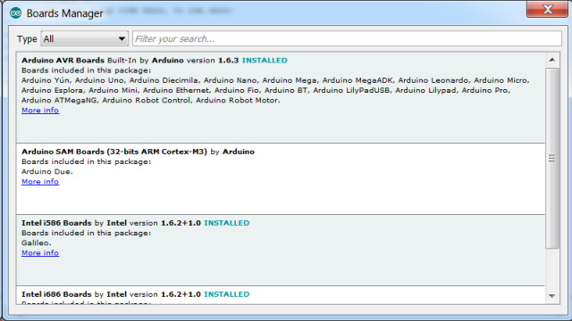
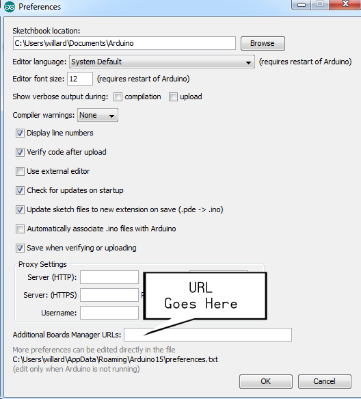
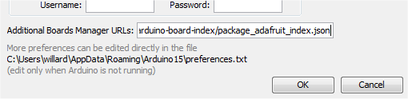
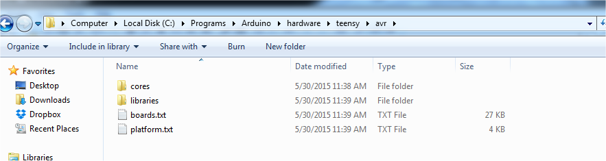
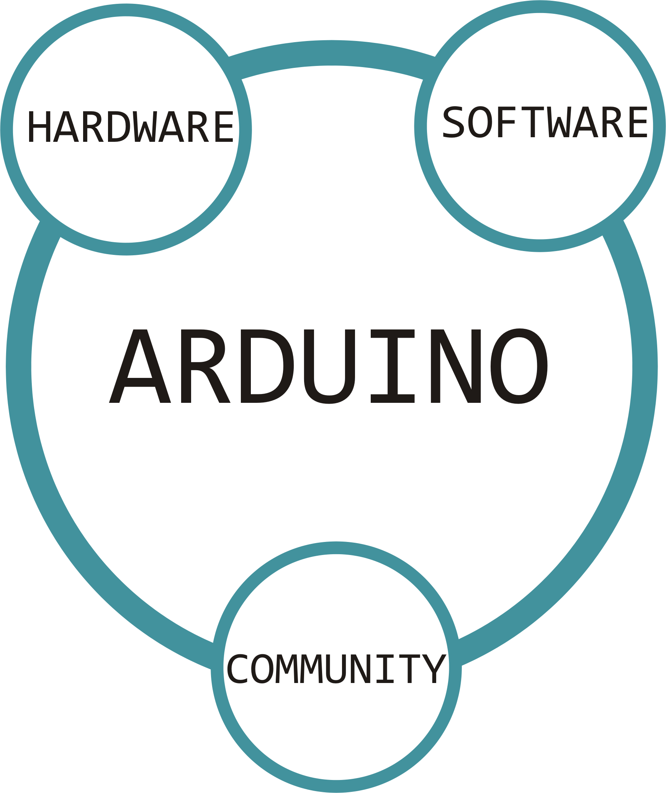
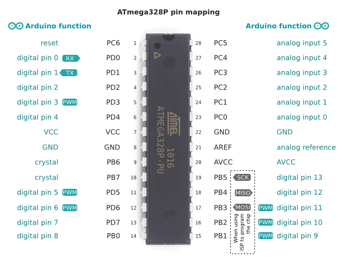
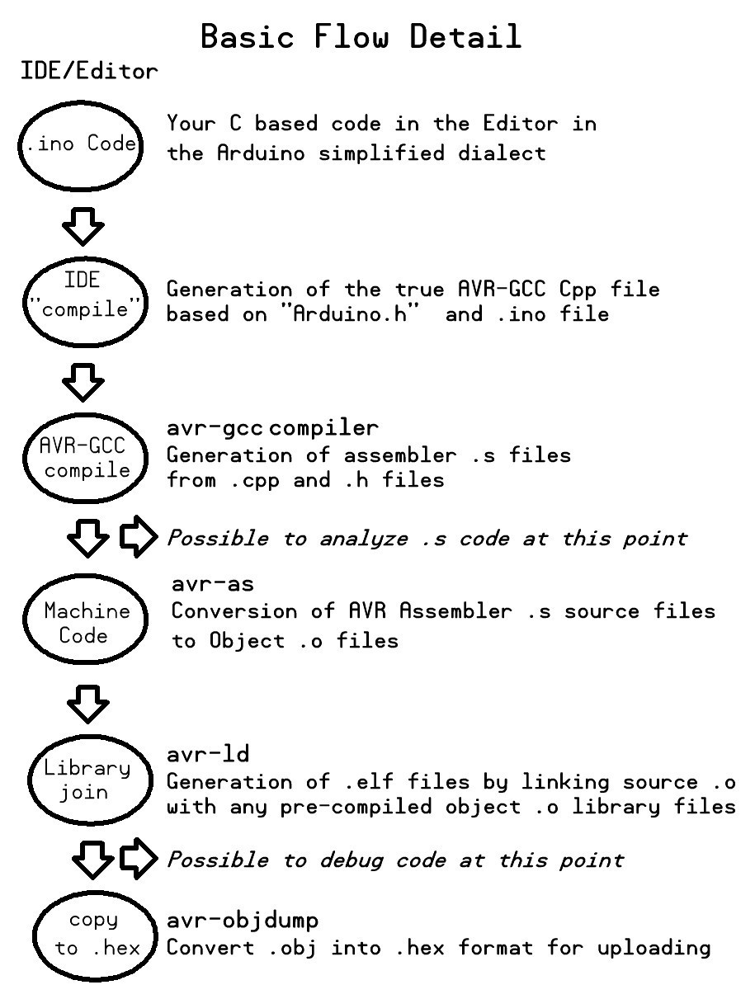
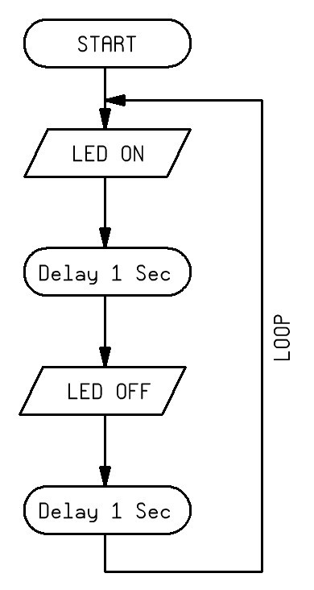

{mainmatter}


# The Integrated Development Environment 

Where are we now with Arduino? 


Now, in 2015, there are many different *Arduino* development board types and they come in many different form-factors.  Minimalist *Arduino* development "boards" can be realized simply with the bare-bones chip and a few external parts while other *Arduino* boards can be hybrid devices with multiple processors and maybe even on-board embedded Linux operating systems. 


We should be in agreement that  *Arduino* is: 

* A micro-controller development platform that is primarily based on the Atmel AVR family of controllers though some other controller families are supported  

* Development board designs that are *almost* entirely open source, which makes it possible for you to build your own development boards from parts that you source yourself.  

* Software that is *forked* from other pre-existing software projects so its stability is based on a software foundation that is older than *Arduino* itself. 

* An Integrated Development Environment (IDE) that is a work-in-progress that gets regular updates.


## Overview of Some Recent Changes to the IDE

New development boards available for Arduino reflect changes in technology, changes in how boards are used and also fulfill a need to have boards that are easier to use or that better match specific boards to desired solutions.  In addition, there have been many recommendations made by users and contributors for improvements the *Arduino* IDE software. 

With the ever-growing list of boards supported by the IDE, it became a complex to add all the custom micro-controller variants to the boards list. In addition, the huge list of available libraries made scrolling though them problematic without some form of a better library menu management. 

*Note: There was a time when you could not even scroll the library list.* 

This section will describe the current status of IDE version 1.6.4 and some of the key improvements that were made to the most recent versions of the IDE.


## *The Introduction of the "Board Manager" in the Tools tab.*


The recently introduced `Board Manager` feature can automatically download and integrate alternative board/controller support with just a click.  

As of IDE release 1.6.4, there are now 3 locations where you can add board/micro-controller support for alternate development boards to the IDE: 

1. Using the User specific  `Application Data`, placing cores in the `packages` folder using the Board Manager
2. Using your sketch folder,  placing cores under the `Hardware` folder
3. Using your *Arduino* program installation folder, placing cores under the `Hardware` folder

T> It many not be initially obvious that you can "click" on the `Board Manager` since it can be almost be mistaken for a menu title.

If you select `Tools -> Board: -> Board Manager...`, you will see: 



The 3 ways to install alternate boards or *cores*:

1. Use the Board Manager and install "Arduino Certified" items from the list
2. Use the preferences menu and define a "Contributed" URL for 3rd Party JSON PAckage list
3. Manually install the core files

### Method 1 - Board Menu

For method 1, a list of the available default/certified boards is shown if you select `All` in the `Type` option. Some will indicate that they are already installed. You have the ability to add a board/core by selecting it from the list and then pressing the install button.   You can also uninstall them, if needed.

I> The Intel *Galileo* and *Edison* are now official, certified *alternate* cores and no longer require separate IDE installations.


The Board Manager will place your new *cores* in a sustainable location that is independent of the IDE release you are currently using, so if you remove your current IDE program folder in preparation for a new release of the IDE, you wont lose your downloaded board support from the previous release.   

T> The IDE will attempt to detect if you need to update your existing installed cores.


On my Windows based system, for example, the Board Manager will place the alternative cores in the following location: `C:\Users\willard\AppData\Roaming\Arduino15\packages`

The IDE will still have the *official* default AVR cores installed in the IDE program folder under `\hardware` when you install a new IDE version. These will be marked as "Installed" the first time you examine the Board Manager.

I> You can see where your Board Manager installed core files are kept by checking the location where your IDE is keeping your `preferences.txt` file.  Use the `File -> Preferences` menu to see your operating system specific location.  The IDE Board Manager will install your board related files in a `packages` folder below where it stores your IDE preferences, so you might want to make sure it gets *backed up* along with all your other user specific files.
 
 
### Method 2  - JSON File URLs
 
The second method of adding 3rd party cores is a bit more advanced. You specify a comma separated list of 3rd party provider URLs under the `File > Preferences` menu in the field marked: **Additional Boards Manager URLs**. You would fill in the web based file specifications for the custom `package_xxx_index.json` files as provided by 3rd party repositories creators.  This option has been available since Arduino IDE version 1.6.4. The new additional boards/cores can be listed and can be found quickly by using the pull-down menu in `Board Manager` and selecting  the "Contributed" type.  



You would fill in the URL or comma separated multiple URLs.





Press `OK` and then close the IDE and re-open it.


I> A quick and easy example of how to do this at [Adafruit](https://learn.adafruit.com/add-boards-arduino-v164) but due to the nature of the web, this link may not last forever.  The Adafuit package list JSON file is here:[Adafruit Board Index Package JSON](https://adafruit.github.io/arduino-board-index/package_adafruit_index.json)   

*Yeah, we got your beanie propeller spinning fast for this one but you now have some 3rd party content!*


W> When you make changes to the `Preferences` menu, you are required to exit the Arduino IDE and restart it for the changes to take effect.

### Method 3  - Manual Installation

The 3rd option is an older option but it does allow easy integration of other alternate cores, especially if they are not available to the Board Manager using the new web based JSON file, as mentioned in option 2.

Releases of the IDE *after* 1.6.0 made adding additional new boards released by third parties much simpler.  It creates a modular and sustainable method for more complex boards that don't have options for method 1 or method 2 described above.   

In method 3, your 3rd party *cores* will not get mixed up with the official AVR cores and you no longer will need to install separate *copies* of the IDE to support the cores like the aforementioned Intel *Galileo* and *Edison* as had been required prior to version 1.63.

I> Example: If you want to manually add support for an **Adafruit** AVR based board that is not included in the current Adafruiut JSON URL, it can be placed in your *Arduino* Sketch folder under `/hardware/adafruit/`.  From there, the **Adafruit** folder will have it's own *core* folder of `/avr/` and then private copies of the `boards.txt` file (*board description files*) and the `platform.txt` file, which describes how the boards show up in their own section of the `"Boards"` menu in the IDE.  Managing 3rd party cores from your sketch folder means that they will remain installed if you change IDE versions.

You can still choose to have the manually added cores placed in a folder named `hardware` in your *Arduino* installation folder, but this would make the *cores* remain specific to the IDE version. If you delete the IDE folder, for the installation of new IDE release, you would also delete your custom cores in the process.  This, of course, may be a desired behavior and it remains a usable option for 3rd party *core* installs. 

I> The **PJRC** *TeensyDuino* installation instructions for the *Teensy* family of powerful *Arduino* *clones* will  instruct you to install the *Teensy* board support in the *Arduino* program installation folder.  It's probably best just to let it work as intended by PJRC. It is fully supported by the latest IDE 1.6.5, so there won't be any issues.




T> The new `platform.txt` file is responsible for defining how the boards related to the *core* have their *upload* files created by defining things such as compiler and compiler settings. Arduino compilers do not use a standard *Make* files.  Arduino uses *recipes* to define the compilation process.

W> If you use multiple methods for core installation, it is possible to end up with multiple instances of the same items in your boards list.


## *Intelligent Tools Menu*

When boards are selected that contain multiple processor options, such as the *Arduino* *Mega* series or the *Duemilanove*, you will see a new menu option that allows you to select which processor type is on the board you have selected.  In addition, the board you have selected will now show up at the bottom right in the IDE next to the current serial port that is being used. Having the wrong board or controller selected or the wrong serial port will cause compilation and upload issues that are not always obvious but at least now you can quickly see if what have selected matches your hardware.


## *Improved Library Support*
Similar to the `Tools -> Board -> Board Manager` improvements, the library menu has a new option called "Library Manager". It is under `Sketch -> Include Library -> Manage Libraries`. In this pop-up menu, you can select a library and press "`Install`" or request "`more information`", which will direct you to the *GitHub* page where the `README` and master files exist for the library.


Selecting "`Install`" will automatically download and install the library into your sketch management folder under "`\libraries\`".   If updates are available, an `Update` button will replace the `Install` button. Installed libraries will show up as `installed`.  You are also able to chose different versions if, for example, a particular release does not work well for you.


You can still manage your libraries manually by using the `\libraries\` folder in your sketch directory and unzipping a new or updated 3rd party library on your own.


Manually adding a 3rd party library to the Arduino IDE requires a few simple steps:

1. Download the library and unzip it since they are usually a zip file.
2. Install it into the Arduino IDE by copying the unzipped folder (files) to your default sketch directory under the `\libraries\` folder. 

*Note:* The IDE should really not be running when you do this.  The next time the IDE is started, the library will show up in your menu list.


I> At this time, there is no option to remove a library from your collection using `Manage Libraries` tool.  Removal of specific libraries would involve manually deleting the top-level folder that contains it.


## IDE Editor Improvements

A quick Google search for `Arduino IDE` will show an almost endless list of how to references to completely replace the simple Arduino IDE with a better code editor experience.  I'm not one of those people who needs to run away from the IDE and I don't advocate ditching the IDE to use *Eclipse* with *Arduino* plugin  or *Sublime* with the *Stino* plugin.  When I'm doing complex editing, I usually just migrate to my favorite text editor, make my changes and then just go back to using the IDE for compiling, debugging and uploading.  With that said, there have been some updates to make the IDE better. 

Some recent changes I personally like:

* Full screen ballistic mouse scroll speed is no longer *ludicrous*

* The IDE now supports showing line numbers in the left margin and it can be toggled by changing the settings in the "`Preferences`" settings under the "`File`" menu tab. Note: Under the program name tab on the Apple platform

* Compile speed has been improved

* Sketches are now saved when you compile or upload (no more lost work)

* Find and replace now works on a full sketch, even if you have it broken up into multiple tabs.


## Exploring the Arduino Dialect



** History Lesson **

*Arduino* is based on open source projects named *Processing* and *Wiring*. *Wiring* was created by Hernando Barragen and was based on *Processing*, which Ben Fry and Casey Reas created as a simple but powerful data visualization tool for personal computers. 

The *Processing* IDE is a cross-platform application written in Java.  It laid the ground work for the whole series of development IDEs that followed. It was *Wiring*  that made the original task of writing simplified C based code for microcontrollers possible.  Having these controllers now interact with code written on a personal computer using *Processing* meant that new interactive and artistic projects could be created quickly and easily, even by novices.  

When *Wiring* was originally introduced however, it supported very few and very expensive development boards that placed them out of the reach of struggling students and hobbyists. This led to the sister project that became *Arduino* which offered a much more affordable development board solution based on inexpensive and simplified AVR microcontrollers and development board. Even now, a typical Wiring development board is based on the Atmel ATmega1281 controller and costs around $60 US.

I> One of the difficult changes that occurred in the move from the early *Arduino* Environment release to version 1.0 is the name change of the header file from `WProgram.h` to  `Arduino.h`.  It was a good change, but it broke all of the libraries that were created prior to version 1.0 so there were many existing libraries that needed to be fixed before sketches could be compiled without errors again. The file, `WProgram.h`, actually *means* "Wiring Program" and since *Arduino* is not *Wiring* but is a fully developed *fork* of it, it made sense to change it to match the new *Arduino* IDE environment. At the same time, the default extention of "PDE" was changed to "INO" for similar reasons, since *PDE* is the extension name for  "Processing Development Environment".  It made it difficult to quickly identify true *Processing* code for the users computer from the code that was intended for the *Arduino* device.  It needed to be changed. 


As mentioned,  the *Arduino* IDE has a historical connection to its *Wiring* and *Processing* past [http://wiring.org.co](http://wiring.org.co "Wiring").  The *Arduino* IDE has not deviated a great deal from either of its predecessors over the years.  The kind of development boards that *Wiring* and *Arduino* implementations support differs, but they also share some development boards in common.  The connection between *Arduino* and *Wiring* remains strong even 10 years later.

If you visit the *Wiring* programming reference page, at [http://wiring.org.co/reference/](http://wiring.org.co/reference/ "wiring.org.co") you will quickly see many of the familiar *built-in* software functions that are also available in *Arduino*.

 
It should be clear that the primary goal of *Wiring*, *Processing* and ultimately *Arduino* is to create a standardized platform and a hardware independent environment for the rapid development of micro-controller based projects.  Here are some clear goals that led to Arduino's success.

* It should not matter if you use a Microsoft Windows platform, an Apple Macbook or a Linux variant, the IDE experience remains be similar.
* It should not matter if you use an ATmega, an STM32 processor, an ATtiny or even an ESP8266 development board, the experience of writing and uploading code should be similar.

On the microcontroller side, the *Arduino* dialect of C++ has maintained its distance from the hardware specific code features of each controller device being used, making it easy to migrate projects to new architectures, called *cores*,  as needed.


I> Being open source, some totally new device architectures are supported by independent solutions which were based on the *Arduino* IDE, such as *Energia* for the Texas Instruments MSP430 family and *MPIDE* for the Microchip ChipKIT series and even the Flutter Wireless boards, which are a recent Kickstarter release. It is not clear, due to the modifications to the Arduino IDE since 1.6.0, if any of these projects will ever merge with Arduino.

As you might have noticed, I call all of the added functions in *Arduino*, a *dialect* of the underlying standard C++ language. These functions add to its "hardware abstraction" abilities and are similar to many of the *Processing* routines. They add to the available C++ tools by providing useful helper routines that can be re-written for each device family core but still provide a common interface.  They also maintain a good amount of isolation from low level device specific code.  Of course, there it nothing preventing you from writing very device specific code if you want to.

A> The *Wiring* IDE now looks a bit dated when compared to *Arduino* version 1.6.4 , giving *Wiring* the look and feel of Arduino around the time of the Version 1.0 transition.

Here's the good news. The *Arduino* environment has changed and improved at a more rapid pace since 2014 and I don't expect this trend to stop.  I feel that much of the information provided about the IDE will go stale rather quickly and therefore, I will not dedicate a lot more time to IDE specifics.  What does seem to be a recent trend is to be able to run an IDE in web browsers.  For example, the first successful attempt at web based *Arduino* coding showed up as a website called [Codebender](http://codebender.cc) where you can use your browser to write code and even upload to the board... and even if you are using a Chromebook PC!  The team at Arduino.cc is currently working on an official web based interface as well.


# Quick tips on some Arduino Helper Functions and Constants

We will skip some of the more traditional items such as standard C style structure, flow control, operators and the things you might find in typical sketches.  Here is a list of some of the slightly less-obvious items, features and/or updates available to you when writing code.

### Setup Related Items

pinMode()

:   Use `pinMode(pin,mode)` in the `setup()` section of a sketch to define how a pin will operate, as an `INPUT` pin or an `OUTPUT` pin. 

What is so special about `pinMode()`?  Well, you may also specify that a pin, when in input mode, attach its internal pull-up resistor with mode qualifier of `INPUT_PULLUP`. 

{line-numbers=off}
``` 
    pinmode(3,INPUT_PULLUP); // enable internal pullup resistor on pin 3
```

   A> Writing a logic "1" or "HIGH" to a pin set for input mode will enable the internal pull-up for that pin. This would be considered the *old* way of doing it.

{line-numbers=off}
```
    pinmode(3,INPUT);
    digitalWrite(3.HIGH);  // enable internal pullup resistor on pin 3, the old way
```


### Analog

analogReference()

:   Configures the reference voltage used for analog readings.  Nearly all example code for the Analog to Digital converter readings rely on the `DEFAULT` value, (Supply Voltage). The full list of options are: 


*     DEFAULT -- the default analog reference is based on the supply voltage (Examples: 5V Uno, 3.3V Fio)
*     INTERNAL -- an built-in reference, equal to 1.1 Volts on the ATmega168 or ATmega328 and 2.56 Volts on the ATmega8 (not available on the Arduino Mega)
*     INTERNAL1V1 -- a built-in 1.1V reference (Arduino Mega only)
*     INTERNAL2V56 -- a built-in 2.56V reference (Arduino Mega only)
*     EXTERNAL -- the voltage applied to the AREF pin (0 to 5V only) is used as the reference.

When the Arduino makes an analogue reading, it compares the voltage measured at the specified analogue pin against the voltage of specified reference voltage. It then converts the voltage into a 10-bit number (0-1023). By specifying a smaller reference voltage, you can get measurements of higher resolution if you can cope with a smaller voltage range.

5V resolution: 5V/1024 units = 0.0048 millivolts per unit
1.1V

Usage: `analogReference(INTERNAL);`


#### Generic 0 to 5 Volt measurements

#### Internal Voltmeter

    : 


### Digital

digitalRead()

:   The `digitalRead(pin)` function will read the state of a specified pin number and return the binary state "1" or "0".  You can use the pre-defined constants `HIGH` and `LOW` or `true` and `false` to perform 'compare' operations on the results.

{line-numbers=off}
``` 
 result = digitalread(6);
 if (result == HIGH) {
    Serial.println("Pin 6 is in logic HIGH state");
    } else {
    Serial.println("Pin 6 is in logic LOW state");
 }

```

What's so special about `digitalRead()`?  Well, you can even use it to verify the state of a pin in output mode.  Surely, you have been keeping track of pin state in your code right?  Well, consider this user created function:

```
void TogglePin(char mypin) {
    digitalWrite(mypin,!digitalRead(mypin));
}

```

No matter what state the pin was in... it will be the opposite after this function is called.  I consider that a convenient function.


### Pre-defined Constants

Here is a list of predefined constants you can use in your sketches

INPUT

   :  Predefined as "0".  It is the PIN setting for the Data Direction Register (DDR) to place a port pin into "input" mode from the micro-controllers perspective.


INPUT_PULLUP

   :  Used with `pinMode(pin,INPUT_PULLUP)` to set an input pin to use the internal pull-up resistor. This is used when interfacing external parts like buttons (which will close a connection to ground (GND)) or with integrated circuits with open collector/open drain outputs.

OUTPUT

   :  Predefined as "1".  It is the PIN setting for the Data Direction Register (DDR) to place a port pin into "output" mode from the micro-controllers perspective.
    

HIGH

   :  Predefined as "1".  It is a named alias for a logic "1" or "`true`" state in binary logic levels.


LOW

   :  Predefined as "0".  It is a named alias for a logic "0" or "`false`" state in binary logic levels.


true

   : An alternate name alias for "`HIGH`"


false

   :  An alternate name alias for "`LOW`"


PIN0 though PIN*x*

   :  The pin labels for pins are pre-assigned port mappings to make dealing with individual pins easier. Pins on microcontrollers are commonly attached to 8 bit wide ports.  In the case of an Arduino UNO, pin0 is actually Port D, Pin 0 and A0 is mapped to Port C, Pin 0.  Th concept of grouping pins into *ports* is hidden from the Arduino coder since it is not a universal construct on all microcontrollers. 

T> Analog pins A0 - A*x* have regular pin names as well. *When defined as digital pins, A0 can be referred to as PIN14, A1 as PIN15, etc.*




LED_BUILTIN

   :  Since there is no longer a guarantee that LED's are installed on PIN 13 as with the original AVR based boards... See Adafruit [Trinket](https://learn.adafruit.com/introducing-trinket/introduction), the constant LED_BUILTIN has been defined to make the definition of the built in LED follow the board selection in the IDE.
    
   This is new and still not universally adopted.  For example, the Trinket core mentioned above still does not have this constant assigned,  It's easy to implement though.  Here is how you would do it:
    
   **For the Gemma:**
    
   Locate your IDE program installation folder, and under `\hardware\arduino\avr\variants\gemma` edit "pins_arduino.h".  In the file, under your pin constants for A0 - A3, add the following line:
   
   `#define LED_BUILTIN 1 `
   
   Save the file and start the IDE. 
   
   
   **For the Trinket:**
   
   Since the Trinket is now installed using the Board Manager, you will find the location of the core packages by first checking the location of your preferences file under `File -> Preferences`.  For example:  "Preferences Location" under `\packages\adafruit\hardware\avr\1.2.0\variants\tiny8`
   
   Edit "pins_arduino.h".  In the file, under your pin constants for A0 - A3, add the following line:
   
   `#define LED_BUILTIN 1 `
   
   Save the file and start the IDE.  
   


readBytesUntil()

:   I started thinking about how I could send commands to the arduino from Python code on my Raspberry Pi. I opted for a COMMAND,DATA structure to simplify parsing.

The goal is to keep it simple and to use a part of the serial library that I have not used yet: “Serial.readBytesUntil()” while avoiding the requirement to include “string.h” in my code. Why? Because I need this to be part of a larger program that already stretches the limits of available RAM on my UNO. The upside of using “readBytesUntil” is that you don’t have to keep checking the input buffer and assemble an array of char… the downside of using “readBytesUntil” is that it has a default timeout of 1 second. So how useful this is in the end remains to be fully tested.

Right now, there is no bounds checking… so if the command text is larger than 10 chars and data is larger than 15, you get “unpredictable” results.

```
//==============================================================================
// Program:      SerialParse.ino
// Author:       Pete Willard
// Version:      1.0
// Target:       UNO R3
// Date:         2013/04/08
// Time:         09:47:54
// Notes:        
//               Uses Serial I/O
// Reference:    
//==============================================================================
  
//=====[ INCLUDE ]==============================================================

  
  
//=====[ CONSTANTS ]============================================================
#define   DEBUG   1   // 0 = debugging disabled, 1 = enabled
const int bSize = 20; 
  
//=====[ PINS ]=================================================================
int Led = 13;
  
//=====[ VARIABLES ]============================================================
  
    char Buffer[bSize];  // Serial buffer
        char Command[10];    // Arbitrary Value for command size
        char Data[15];       // ditto for data size
        int ByteCount;
  
//=====[ SUBROUTINES ]==========================================================
  
void SerialParser(void) {
//
//  One command per line.  Eventually, Data may have multiple 
//  fields separated by ":"
//  Command Format: "up to 5 Letter command, up to 10 letter data<\n>"
//                  No checking.
//
//  count will  be below Zero on a timeout.
//  read up to X chars or until EOT - in this case "\n" 
 ByteCount = -1;
 ByteCount =  Serial.readBytesUntil('\n',Buffer,bSize);  
  
   if (ByteCount  > 0) {
        strcpy(Command,strtok(Buffer,","));
                   
        strcpy(Data,strtok(NULL,","));             
   }
   memset(Buffer, 0, sizeof(Buffer));   // Clear contents of Buffer

}
  
  
//=====[ SETUP ]================================================================
void setup() {
    Serial.begin(9600);
    pinMode(Led,OUTPUT);
    if (DEBUG) {
        Serial.println("Debugging Enabled");
    }
      
}
//==============================================================================
  
//=====[ LOOP ]=================================================================
void loop() {
  
    SerialParser();
         if (ByteCount  > 0) {
          Serial.print("Command     : ");
          Serial.println(Command);
          Serial.print("Data        : ");
          Serial.println(Data);
         } 
        
}

```


#Programming Framework

This section is about coding as much for yourself as for others.  While it might be easy to write pages of code with only a few comments and a loose structure, in the long run, writing well structured and clearly legible code helps a lot when you return to it months later and want to share it with others for advice are forced to ask yourself "*What was I thinking?"*

A> **Programmers Lament:** *'I think I wrote this section of code late at night after I had a few beers with friends.  I think I need to go out and have a few beers to understand why I wrote it like this.'*  - an anonymous Lotus 1-2-3 programmer I once had dinner with

I try to write all my code as if I was about to post it to a public blog and that the reader will not immediately have knowledge of what my goal is.  This means that I will need to explain myself clearly, in my code.  This will also impact the kind of comments I write and will remind me that resorting to cute code tricks and obfuscation (even accidentally) is a bad idea.

I will admit that I am not a professional programmer, but I play one on IRC.  Joking aside, I am not even a trained programmer unless your count reading books on programming.  My advice here comes from concepts I have learned though years of reading other peoples code and working on my own.  I have found that what I call  *good*  code is written by someone who is well organized, writes decent comments and is reasonably methodical in how they break down a problem.  Some of my own ideas start as inspiration from these organized and creative programmers whose shoulders I stand on. I will show you a programming template technique I learned from Jon McPhalen, a programmer that works with Parallax controllers.

A> **Programming Concept:**  *"Always include attribution and give appropriate credit for your borrowed ideas."*

While there are some decent books on programming style, it's not the main focus here.  This is about remembering that you might have a future audience that reads your code,  so writing efficiently, being consistent and adopting good conventions is paramount.

## Using a template for organized code

The *Arduino* environment enforces a bare minimum of coding style upon us. It lets you get started quickly and painlessly. It requires you to write using the core C++ language and that you employ only two required sections of functionality to the sketch code.  Our code sessions typically start with the snippet below and proceed from there:

```
void setup() {

 }

void loop() {

 }
```

While it is nice that the *Arduino* developers have saved us a lot of trouble by making *getting started*  so easy, it really doesn't doesn't provide much in the way of guidance.  When you come back later to revise your code you might find big mess of mashed up confusing spaghetti code that you wrote because you thought, "Hey, I'll make it pretty later" .   The goal here is to start with a template that is nicely sectioned out so you have a road map for moving forward and being organized right from the beginning.

 Here is an example of my template as a starting point:

<<[My Starting Template - template.ino](code/template.ino)

A> I realize that this is bit of overkill but I personally find that this format helps me organize my coding.  I went so far as to write a small program that uses a fill-out form to create this template on demand.  *(To be included in extras)*

A quick review shows that the template has defined a constant that you can use while debugging code.  Changing this constant between 0 and 1 will enable you to write some conditional code that will print or stop printing *debug* data with just simple edit.

It also contains an example of using meaningful names.  Using the variable assignment such as  `onboardLed` for `pin 13` helps to make the code more readable.


A> **Programming Concept:**  *"Code should be written so someone does not need to spend a lot of time trying to understand it."*

### Variable Naming
Variable names don't need to be short and are much better when you use multiple words that are compounded into a meaningful descriptive name. For enhanced readability,  try to avoid ALLCAPS and avoid variables with leading underscores.  Try to adopt the much more accepted *camelBack*  notation.  This notation starts with lowercase and is the practice of writing compound words or phrases such that each following word or abbreviation begins with a capital letter [^f].  Inserting underscores inside variable names makes the camelBack method redundant so just pick one and stick with it or come up with your own... and stick with it.

[^f]: The case where the leading letter is lowercase but all subsequent words are capitalized is also called the Microsoft style.


### Comments

A> **Programming Concept:**  *"Comments help the reader know what the author knows."*

Some *comments* about comments.  I have a truly brilliant colleague who writes wonderfully performing system administration code to automate daily tasks.  You would never know that by reading it however, as his source code looks like shorthand with literally no comments.  The code works, so where is the issue?  Well, sometimes, it doesn't work... and they are not around... and here we are with interpreted source code we can modify and we are scratching our heads trying to figure out the program flow.  What is my take from this?  That good and smart programmers are not always diligent at documenting what they do.  My colleague argued that he "writes code because he *is* basically lazy" and would prefer that the computer did the grunt work. He also expects that we are smart enough to figure it out. What he doesn't take into account is our time spent "getting inside his head" to be able to revise the code with confidence.

While "code with no comments" is a worst case scenario, there is an other side of the story.  Let's you were doing some programming homework for class and your instructor asks you to document every line of code.  If you step back an ask yourself "Why would they ask us to do that?", you might conclude that it is an industry *best practice* to document every single line... right? Well, the truth is more likely that instructor just wants *you* to explain *them* very clearly what you are thinking at every step. This is great for the instructor in an academic environment, but not so great for real world code.  The truth is that the most lines of code in a program will be reasonably self documenting, but some sections will benefit from added clarity of comments.  The best practice is really to only comment where it might be unclear what you are doing or thinking.

Example

: Wasted Comment  - Lets say you have an LED wired with a resistor and have the Anode of the LED tied to Arduino positive supply voltage.  You know that bringing the pin LOW will light the LED.  Since this is rather troublesome for beginners, you create a `#define LED_ON 0;` and `#define LED_OFF 1;` definitions in your code.

```
Digitalwrite(LED_BUILTIN,LED_ON); // Saying --> LED ON <-- here  as a comment is not really needed
```
T> Try to imagine what the reader will need or want to know.

But keep in mind that there will need at some point to explain what you are trying to do and why you are doing it or why you choose one particular approach over another.


T> If you can't say anything really useful, don't say anything. 

So, some best practices for you to adopt could be:

1. Create a standard header block with good descriptions
2. Add liberal comments, but not when the code makes it clear what is happening
3. Record your thoughts as comments, as you go
4. Try not to exceed 80 chars per line of comments, be brief
5. Adopt a variable naming style and stick with it
6. When you create constants, explain them, lest they become magical numbers
6. Avoid using "a" "b" "c" style variable names unless it is a loop counter
7. Add visual breaks to make code more readable
8. Comment your flaws and to-do items
9. Avoid ambiguity... read your comments carefully to make sure they mean what you think they mean


## Planning

I get the best results when I start with a notebook as opposed to jumping into the IDE and thinking *"Now is the time on SPROCKETS when we dance!"*. Ok, apologies for my poor attempt at some Saturday Night Live humor.  Jumping in and coding might be fine when you only have a few lines of code, but when you project involves multiple pieces of external hardware such as using sensors, driving displays, etc... it is going to need some planning.

By planning, I mean;

* Define your goal or project accomplishment.
* Decide which development board or controller are you going to use.
* Jot down some Pseudo Code or a write multiple step explanation of how to reach your goal
* Begin prototyping your code
* Layout some initial tests on the solder-less breadboard and attach to Arduino board
* Start the Test/Upload/Debug process adding or fixing things as you progress
* Update your notes with results

## Modular Thinking

To me, when it comes to reading other people's code, there is nothing more disturbing than reading page full of  `if` conditional statements that include redundancies and a clear sign of poor planning.  If I need to keep track of more than a few conditions while reading code I find that the logic flow is easily lost.

My approach to solving this has always been to create function blocks of code with the goal of keeping the main section, in our case the `loop()`, as clean and as readable as possible.   In C++, this is called creating a *function*  and it is sometimes referred to as a procedure or subroutine.  I personally will use all three terms interchangeably.

In most cases, you will write a procedure that accepts an argument and returns a result but this is not a requirement for a function.  For example, you can have a function that just performs a task that makes the rest of your code look cleaner.  Like this:

    void printBreak() {
      Serial.println("=============================");
    }


So in your main code, all you need to type is:

    printBreak();


In one of my programs, I have a `loop()` section that basically contains 3 steps:

```
void setup() {

}

void loop() {

   sampleSensors();	// collect all external sensor variable data
   printResults();	// send the results in 1 CSV formatted line
   cycleCheck();	// is it time to get updates from sensors?
}
```

The functionality of the loop section remains clear now that it is made up of function blocks and it is not bogged down with many logic decisions. The logic and action steps are reserved for the procedures themselves and the procedures call other procedures to keep things organized.  Breaking up tasks will actually help make your procedures more useful and in a lot of cases, re-usable.

T> Make your program flow readable.

A> Using these techniques I was able to write an *Arduino* based weather station that employed many sensor devices and numerous weather related calculations that ended up being well over 1300 lines of code before I realized that my program really was rather complicated.  A large complicated program like my weather station is really just a collection is smaller code sections that I wrote and integrated into the final program one section (or function) at a time.

So in the end, I did write more functions and lines of code rather than keeping coding to minimum but I'm pretty certain that someone reading my code won't get lost.

## Learning Bit-Wise Operations


## What is all this about interrupts anyway?

You know, there was a time when I knew nothing about microcontrollers and of the topics that can completely elude you is controller interrupts. One of the reasons is due to the fact that it's not always obvious when you need to implement an interrupt in your code.


### Project: Creating Cooperative Functions

### Project: Creating Libraries

## Using 3rd Party Libraries Effectively

# The Atmel AVR Toolchain

The open-source AVR Toolchain is known as AVR-GCC.  It was at the core of the original *Wiring* project that the *Arduino* project was based on.  The job of any of the toolchains is to produce your source code into machine code that the AVR or other micro-controller will execute.

Here is a list of the components that make up the AVR-GCC toolchain that are included with the IDE.

| GNU Compiler    | Description	                                                      |
|=================|===================================================================|
| gcc.exe         | C cross compiler for AVR code (including c++.exe and g++.exe)     |
| as.exe          | Assembler tool for producing AVR code                             |
| ar.exe          | Library manipulation tool, archiver                               |
| ranlib.exe      | Library index utility                                             |
| ld.exe          | Linker to link 'obj' modules                                      |
| nm.exe          | Extracts a symbol table from an object file                       |
| objdump.exe     | Displays information from multiple OBJ formats                    |
| objcopy.exe     | Assembles the created object modules into multiple output formats |
| avrdude.exe     | Programming tool for AVR MCU FLASH Memory                         |
| strip.exe       | Discard symbols from files                                        |
| avr-libc        | The C runtime libraries and header files for AVR MCU's            |


## The Quick Overview

Your sketch must be translated into a form that can be uploaded to the Arduino hardware. The process is called compilation but it consists of many individual steps before the code can be uploaded into the Arduino's memory.  The process involves compilers, linkers, archivers, object manipulators and uploaders/downloaders. To the uninitiated, the whole process is a bit confusing.  You don't even really need to know much about it if you never stray from the Arduino IDE.


## Who mangled my sketch code?
So what happens when a user selects the "Verify / Compile [Ctrl+R]" option from the "Sketch" menu of the Arduino IDE? 




 

Reminder: We are discussing how to compile code the AVRGCC way.

So lets say we have a simple program that doesn't do very much.  Even a simple blink example goes through the same  process as a complex file, so we will use the default blink in an example. The success of Arduino is largely due to it being a standardized platform with a hardware independent environment for the rapid development of micro-controller based projects. To achieve the rapid development goal, even for people who have never written code before, the underlying complexity of the compilation process is largely hidden from view. 

Here is what the sketch does.



The original *Arduino* `blink`;

~~~~~~~~

/*
  Blink
  Turns on an LED on for one second, then off for one second, repeatedly.

  This example code is in the public domain.
 */

// Pin 13 has an LED connected on most Arduino boards.
// give it a name:
int led = 13;

// the setup routine runs once when you press reset:
void setup() {
  // initialize the digital pin as an output.
  pinMode(led, OUTPUT);
}

// the loop routine runs over and over again forever:
void loop() {
  digitalWrite(led, HIGH);   // turn the LED on (HIGH is the voltage level)
  delay(1000);               // wait for a second
  digitalWrite(led, LOW);    // turn the LED off by making the voltage LOW
  delay(1000);               // wait for a second
}

~~~~~~~~


### Things you didn't have to type


During the build process the Arduino IDE perform four major tasks:
* Combine local files: The files in the folder are merged together
* Mangling: Function prototypes are added and required #include statements are added
* Compilation: All main and supporting files are compiled into object files 
* Linking: The object files are linked together with library files. The result of these steps is a .hex file
* Uploading: AVRDUDE is used to send the file from the PC to the Arduino board to be inesrted into program memory


The IDE actually re-writes your sketch code using what is called a 'recipe' process for your selected controller into a valid C++ program.  It will automatically merge the code from all your tabs (tabbed files are in the same folder with no extention), create function prototypes and insert and process the "`Arduino.h` file before continuing to use the AVRGCC compiler, binutils and avrdude to upload your compiled sketch. The 'Arduino.h' file includes all the definitions needed for the standard Arduino core.


T> The IDE will merge any additional files in your sketch folder into your main code but it will not automatically create the `#include` statements for any `.h` files in the folder. The IDE knows that the `.ino` file in the folder with the same name as the folder is the master file.
`
If you read up on the normal AVR-GCC complilation process, you will realise that a recipe process is not a `makefile`, per se, but is used by the build process for *Arduino* sketches to create the same results in the end. You won't actually find a `makefile` if you go hunting for one.

So the sketch quickly becomes a 'cpp' file that looks like this... for example:

```
#include "Arduino.h"
void setup();
void loop();
#line 18
void setup() {
                                            
  pinMode(13, OUTPUT);
}

                                                     
void loop() {
  digitalWrite(13, HIGH);                                                 
  delay(1000);                                  
  digitalWrite(13, LOW);                                                 
  delay(1000);                                  
}

```
Line 1 gets added to insert all of the Arduino magic, so you never have to include this file yourself. The `Arduino.h` file imports (includes) a header file that contains some key Arduino definitions and additional includes that is primarily responsible for setting the stage to make Arduino coding simpler.

Lines 2 and 3 are automatically generated "prototypes" from the functions/subroutines in your 'ino' file.  They are required by the C++ program but you are spared having to do this manually.

The rest is your original code.

From here, the IDE recipe uses the contents Arduino.h to include all the other behind the scenes core code needed to make the program function.  Things you never really need to concern yourself with.  Had this been a standard AVRGCC program, these extra steps extra code callouts would all be manually added by the programmer. 


In the compilation process, the file main.cpp get inserted into the list of items to merged.  This source code file actually creates the sections of code that the compiler requires, since C style programs all begin their execution in a function called `main()`. Here is what it looks like:

```
#include <Arduino.h>

// Declared weak in Arduino.h to allow user redefinitions.
int atexit(void (* /*func*/ )()) { return 0; }

// Weak empty variant initialization function.
// May be redefined by variant files.
void initVariant() __attribute__((weak));
void initVariant() { }

int main(void)
{
	init();

	initVariant();

#if defined(USBCON)
	USBDevice.attach();
#endif
	
	setup();
    
	for (;;) {
		loop();
		if (serialEventRun) serialEventRun();
	}
        
	return 0;
}

```

It is required to also include the Arduino header file, `#include <Arduino.h>`. 

The section related to *variant initialization* is related to things like pin definitions which in some cases can be different, even when the board definition is the same.

Then comes the important part... the main() section makes 2 key function calls; the first one to `setup()` and the second on to `loop()` from inside code that performs a infinite loop so it gets called continuously.  Yes, these are the functions in your *Sketch* code.


### Included by default:

Some things that you don't need to write in your *Arduino* sketch code because they are already in `Arduino.h`:

** Standard INCLUDE files **

These items are things you likely would have to have if you were coding the the AVRGCC way versus the Arduino way.

```
#include <stdlib.h>
#include <stdbool.h>
#include <string.h>
#include <math.h>

#include <avr/pgmspace.h>
#include <avr/io.h> // Micro controller specific
#include <avr/interrupt.h>
```

** Math related macro code **
This are just generally handy macro's to have available... assumimg you knew they existed. Now you do.

```
#define min(a,b) ((a)<(b)?(a):(b))
#define max(a,b) ((a)>(b)?(a):(b))
#define abs(x) ((x)>0?(x):-(x))
#define constrain(amt,low,high) ((amt)<(low)?(low):((amt)>(high)?(high):(amt)))
#define round(x)     ((x)>=0?(long)((x)+0.5):(long)((x)-0.5))
#define radians(deg) ((deg)*DEG_TO_RAD)
#define degrees(rad) ((rad)*RAD_TO_DEG)
#define sq(x) ((x)*(x))
```


# Projects

## Project 1 - Customizing

## Project 2 - Build your own library

## Project 3 - Create "blink" sketch without Arduino
