{linenos=off}

-# Technician Training

# Technician Level Electronics

You might have encountered the electronics aspects of using *Arduino* with some level of trepidation, since my observations have shown that far more people come from a software background than an electronics background. In this chapter we will build up some electronics skills from almost the ground up to attain a technician level of knowledge. To really Use the *Arduino* properly, it might seem that you need 2 years of an Electronics Engineering degree, but I will attempt to eliminate that concern.  

If you are comfortable with basic electronics then this section will be an overview of the skills being developed. It can be a bit dry at times but I'm sticking with technician level knowledge and will avoid the engineering level details as much as possible.  To make it a little more interesting, I'll include some historical information.

T> I would advise anyone that has a desire to go beyond just blindly copying circuits and projects from the Internet and/or from beginner books to start writing a blog, keep a bench diary or just keep some notes in a simple notebook.  This can prove to be valuable, as it has for me,  if you decide to write-up your projects for others to consume, such as sharing when you have learned in places as the 'Instructables' web page. *http://www.instructables.com*

 Keeping good records that include the data sheets you used in a project can be very handy since electronic parts sometimes become obsolete very quickly.   Having a "design idea notebook", with data sheets and experimental drawings and personal notes can prove to be quite valuable at some future date even if it is just to brag to others about what you experimented with.  There are some useful places on the Internet to search for data sheets.  These include 
 *  http://www.datasheetcatalog.com - Easiest to use but has the smallest amount of available data sheets
 *  http://www.alldatasheet.com/  -  This site has the most aggressive parts matching algorithm and cant match well, even with a partial part number.  It presents data sheets as "inline" pages wrapped in add banners so it has some small amount of user interface annoyance since it makes all downloads use a default name "datasheet.pdf".
 *  http://www.datasheetarchive.com/ - The most confusing of the 3 sites and has many *results* that are just screen captures from old "equivalent parts" lists and not full parts data sheets.  They use the approach that something is better than nothing.

## Abbreviation and prefixes

As you may have realized by now, there are a set of abbreviations that keep showing up in electronics data sheets and documents that are part of the language that all engineers use.  Here is a list of some of them;

| Quantity| Unit| Abbreviation |
|=========|=====|==============|
| Time    | second | s |
| Frequency | hertz | Hz |
| Power   | watt | W |
| Voltage | volt | V |
| Current | ampere | A |
| Resistance | ohm | {$$}\Omega{/$$} |
| Capacitance | farad | F |
| Inductance | henry | H |

### Prefix list

| Multiplier | Prefix | Abbreviation |
|============|========|==============|
| 10[^12]    | tera   | T            |
| 10[^9]     | giga   | G            |
| 10[^6]     | mega   | M            |
| 10[^3]     | kila   | K            |
| 10[^-3]    | milli  | m            |
| 10[^-6]    | micro  | {$$}\mu{/$$} |
| 10[^-9]    | nano   | n            |
| 10[^-12]   | pico   | p            |

## DC Voltage

DC Voltage

: Voltage is a way of using numbers to describe an *electric' field.  Notice that I did not say 'magnetic' field.  When ever a negative charge is able to attract a positive charge there is voltage. Voltage is the measurement of a potential differnce between the 2 points involved.

If you think of it from a 'potential' point of view, imagine that voltage is a ladder with many rungs.  1 volt is closer to the ground than 2 volts and so on. *This analogy also helps to understand the concept of "ground" in a circuit.*  Ground is a *known* point of reference.  Negative voltages are merely values that below ground with respect to *other* measured values elsewhere.

The possibility of the 'electric field' being able to leap across distances between negative charges and positive charges without the aid of a conductor is normally very weak. But this is exactly what lightning and static electricity are.  When the electric field potential (voltage) between the negative charge and the positive charge are high enough, we can see a spark across a small air gap such as with an automobile spark plug or with lightning when related to weather conditions.

I>   We have the American Benjamin Franklin to thank for originally assigning the positive and negative labels relating to electrical polarity.  He also originated the use of the term "electrical ground" related to his experiments that proved that lightning was, in fact, a form of electricity.  He did in fact use the *ground* in his experiements and pioneered early lightning arrestor designs for taller buildings suceptable to lightning strikes.

So, in summary, voltage is a measurement of the potential of an electric field. We normally use highly conductive metals, such as copper and silver and aluminium, to facilitate the flow of charges in a self contained system called a circuit.

W> *Don't Misunderstand Voltage*

Most people, when asked, would say that 9 Volts is safe and that say, 10,000 volts will kill you... but the truth is, they would be wrong.  The measure of what will kill you is actually related to current forced through your body and not voltage.  Nearly any amount of current over 15 milliamps can give you a jolt and it is currents near 150 milliamps (mA), similar to what is used to drive a small toy motor, that can be be lethal.  Under the right conditions, muscular spasms can occur that severely affect the heart.

So what is the reality about lethal voltage?  Well, your body forms a rudimentary resistor/capacitor combination and when the combination of current and voltage is enough that the human body can operate more like a conductor than an insulator, you can achieve electrocution if vital body parts are involved.  It has been known to occur with as little as 48V DC if enough current is available and it traverses the right path, or wrong path depending on your view.  It's something to keep in mind.

## DC Current

Direct current (DC) is the directional flow of an electrical charge.  A battery is a device that uses a chemical reaction to create a voltage and is a primary example of a DC power source.  Devices of this type are called galvanic power sources.  Direct current flows in a constant direction as opposed to Alternating Current (AC) and is the basis of many early experiments with voltage and current.  Direct current is formerly associated with the term "galvanic current", which is current produced by a chemical reaction. 

DC current is an easily misunderstood entity.  Experiments with electricity in the 1700's using materials such as glass rods and silk cloths eventually was understood to be the shifting of a charge from one item to the other. Benjamin Franklin decided that that the cloth was pulling charge from the glass rod so the glass rod must have less and the cloth must now have more, leading to the decision that "less" is negative and "more" is  positive. Around this time, the term "fluid" was commonly associated with this behavior so the liquid analogous terms such as "flow"  are still used today.

So here is where the confusion starts. Much later in scientific history, when atomic structure and behavior were better understood, it was determined that these units being transferred are "electrons". Electrons actually have a bit of freedom to migrate and even transfer to a nearby atom, leaving the original atom intact but with a slight charge difference. If you expand this behavior it even applies to items of a different material. This explains how charges can be shifted with the glass rod and silk cloth. In reality, the glass rod gained a positive charge when electrons were shifted away to the cloth and that the cloth, now with the excess electrons,  has a negative charge.  By the time that the true nature of electron charge flow was understood, the Franklin definition of charge was so well established it could not be easily changed.

As a result, current flow in a circuit can be described as "conventional" flow  or "electron" flow.  As long as it remains clear which method is being used in a particular discussion, the confusion should be minimal. Schematic diagram symbols will mostly follow the conventional flow approach, for example.

### So how does current flow?

When a circuit is created by applying a power source, there is a voltage potential difference between the two supply connections. When electrons interact one another in a conductor, they interact based on a sort of cascading effect.   A single electron does not flow from one end to the other, it is more like the chained reaction where flow is accomplished by transferring charge between neighbors as long as a difference of potential exists. The electricity will flow from one end to the other end of a circuit at the speed of light.

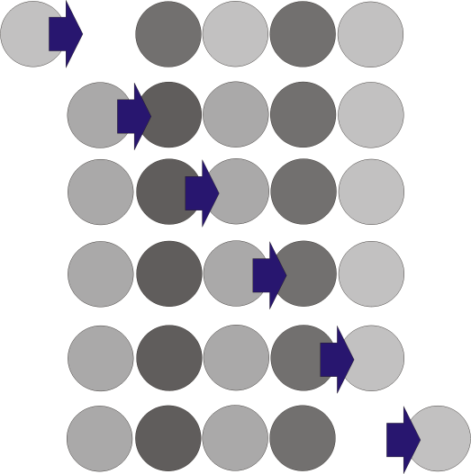

While not totally accurate, since it is a bit more chaotic than the marbles in a tube shown, the general behavior is that while there remains a potential difference from the power source, the electric field of each atom in the path can pull electrons from neighbors as long as there is pull on one end and push in the other otherwise known as the negative and positive leads of a power source.

Current is the measurement of the *amount* of electrons flowing at a particular spot in the circuit. Current is measured in Amperes (Amps)  and is the measurement of a specific number of electrons per second.  So a measurement of current is the flow rate or amount of electrons shifting per second but the electric field changes in a conductor occur at the speed of light.

## Power Sources

A very common question tha comes out of the beginners mouths is, "Is it dangerous to supply an arduino with a 10 Amp 12 Volt power supply?".  The answer of course, is "no", it's not dangerous to the Arduino.  A power supply has the ability to deliver curent to a load based on the ratings of the components it was created with.  If the device being powered exceeds the capacity of the power source, the voltage can drop below what is needed for the device to work.  It also means that if you have a high current capacity power source and you accidently create a low resistance path between the 2 power rails... bad things can happen.  It's always best to have power source capacity be 25% more than the worst case load conditions for a device.  In this way, you can keep size and wasted capacity to a minimum.

### USB
USB sockets in a PC will supply 5V at 100 mA by default. The can be told to provide up to 500 mA per socket and it is possible to join the power pins from 2 sockets to get more current.

USB wall outlets are available that can provide much more current because they are wired for power only.  2 Amp, 4 Amp and even higher are available.

### Wall Warts

These should be considered to be unregulated power sources and they will seldom deliver exactly what it says on the unit.  The good thing is, we will nearly always use these as the voltage source for an on-board regulator, like the DC jack on the Arduino that feeds the on-board voltage regulator.

### Batteries

When using batteries, you need to understand the demands of your circuit and the limitations of some battery formats. here is a chart that will help:

|Battery |Nominal | Rated    |  
|Type    |Voltage |Capacity  |
|========|========|==========|
| 9v     | 9V     | 570mAh   |
| AAAA   | 1.5V   | 500mAh   |
| AAA    | 1.5V   | 1,150 mAh|
| AA     | 1.5V   | 2,879 mAh|
| C      | 1.5V   | 7,800 mAh|
| D      | 1.5v   |17,000 mAh|

This chart pretty much shows why using a 9V battery is not ideal for the average Arduino project that will likely use between 75mA to 150mA.

### Bench-top and Industrial Power Supplies

Industrial power supplies, like these you can by from EBAY or Amazon usually run between

### Power Sources You Can Build

**Easy Variable voltage supply**

** The EBAY special Supply**

**A design you can own**

## Component Review
*What is a component?*

The quick and rather dry explanation is: *Electronic components are the discrete physical items in an electronic system that are used to impact the behavior of a circuit in a known way.* 

It is due to the individual behavior of each component in a larger system that makes an electronic design work as intended.  Components are available as individual devices, such as discrete diodes, resistors and capacitors or may be arranged in an array for smaller packaging, as "potted assemblies" or as part of manufactured modules known as integrated circuits.

I have seen many cases where someone will ask "*What is this part?*" about something that they removed from a circuit board.  Component identification is an easily learned skill that is very useful if you attempt to recycle parts from obsolete devices such as discarded Cathode Ray Tube displays or disk drives, etc.  These can be a goldmine of useful free parts for tinkering with ideas on the breadboard.

## Active and Passive Components

An electronic circuit will usually be comprised of many passive and active components together.  A passive component is one that

A *passive* component cannot increase the signal the signal in a circuit.  The power through a passive component will always decrease the signal to some degree.  An active component can use the signal level in the circuit to control other components in the circuit, recreating or increasing the value of voltage or current.  Active devices will need separate power sources to perform their tasks.

## Some Common Characteristics of Discrete Components

### Tolerance

Many discrete components will have given values that define how they will behave in a circuit design. While these values should be close to the described value by the manufacturer, the *actual* value of a part may deviate a certain amount from the stated value.

The maximum deviation allowed from the specified value is known as the tolerance. It is usually given as a percentage of the stated value though for very small capacitors I have seen tolerance specified in pico farads and for quartz crystals in PPM (parts per million) deviation.  

Do not assume that a given a lot of components will have values distributed throughout the acceptable range of values. A lot ordered with a 20 percent tolerance will likely include no parts having values within 5% of the desired nominal value. There is a cost associated with devices with less tolerance variations, such as with 1% parts so this should always be a part of the design considerations.  

There are many cases where the values are not critical and less expensive parts can be used while in other cases, such as resistor/capacitor based timing circuits, where tolerance drift can create behavior outside of what is expected.

## Voltage Rating

Many parts have a normal operating voltage and a maximum voltage rating which is sometimes called the break-down voltage rating.  The maximum voltage that can be applied to a part continuously without causing the part to fail is the normal operating voltage.  

The maximum rating is a test voltage value that when applied will cause damage to the part.  A very easy mistake to make is to use the *maximum rating* as the safe value.  This can occur when a person is unaccustomed to reading data sheets or they are unaware of the need to create a design with conservative values.

## Current Parameters

Essentially, anytime you pit thermal power dissipation against current flow, there will be a point where the natural thermal dissipation of the device won't be enough to wick off the current generated heat build-up.  This will be true for wiring as much as it is true for discrete components and semiconductor devices.  At this point, there needs to be a heat sink added or higher capacity components must be used... or a combination of both.

## Thermal Parameters

The resistance to electron flow of nearly all metallic conductors rises with temperature.  This variation is usually not a concern when designing circuits but it can become a factor in a non-conservative design.  This increase in resistance is not universal and in some cases the opposite behavior occurs, such as with carbon based resistors, where the resistance decreases with temperature rise.  Below is a table of many discrete devices an their reaction to temperature.

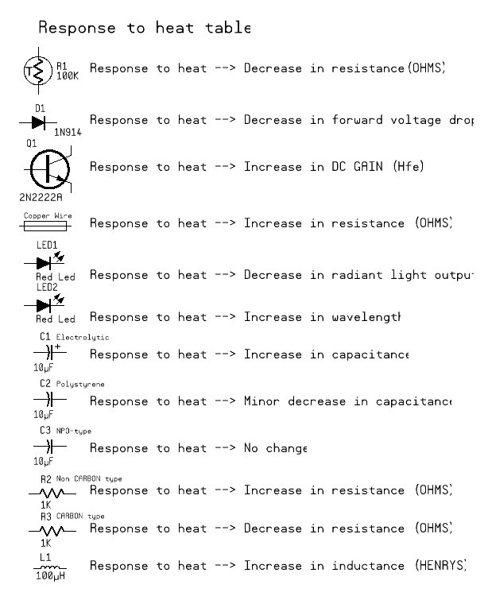

Semiconductors in particular are sensitive to extreme heat

## Color Code
Color codes are used to identify the value of some  types of components and these follow a progression based on prismatic colors, like those a rainbow. Axial lead components can be color coded with circumferential bands of color to indicate resistance, capacitance and inductance as well as tolerance.

The component value can be decoded by starting with the band closest to one end of the part, where the first 2 bands are value and the 3rd color is a multiplier and the 4th band being tolerance.  There also exists a 5 band standard where the first 3 bands are value and the 4th band is a multiplier and the 5 band is tolerance. The five band notation is more common with components with better than 5% tolerances.  

|Color	|Value	|Multiplier	|Tolerance|
|-------|-------|-----------|---------|
|Black	|0	|1              |         |
|Brown	|1	|10             |  1%     |
|Red	|2	|100            |  2%     |
|Orange	|3	|1,000          |  3%     |
|Yellow	|4	|10,000         |  4%     |
|Green	|5	|100,000        |  0.5%   |
|Blue	|6	|1,000,000      |  0.25%  |
|Violet	|7	|10,000,000     |  0.1%   |
|Gray	|8  |100,000,000    |  0.05%  |
|White	|9  |1,000,000,000  |         |
|Gold	|	|	            | 5.00%   |
|Silver |	|		        | 10.00%  |
|<none> | 	|		        | 20.00%  |

### Examples

The first example is 4 band and the second example is 5 band

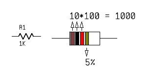

* Brown Black Red Gold = 1 then 0 * 100 for a value of 1000 at 5% tolerance

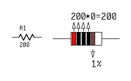

* Red Black Black Black Brown = 2 then 0 then 0 * 0 for a value of 200 at 1% tolerance

## Standard Values
The EIA and other standards organizations all agreed to a "preferred" value system for devices such as resistors. These standards define value sets that would include "reasonable" values of components and it originates from a time when tolerances like 1% were unobtainable (*see that 1% is aligned differently. Originally, 5% was the best attainable tolerance*).  They selected values based on reasonable tolerances that were able to be manufactured.

| 20% | 1.0 |     | 1.5 |     | 2.2 |     | 3.3 |     | 4.7 |     | 6.8 |     | E6|
| 10% | 1.0 | 1.2 | 1.5 | 1.8 | 2.2 | 2.7 | 3.3 | 3.9 | 4.7 | 5.6 | 6.8 | 8.2 | E12

The progression continues for E24 at 5% tolerances and E96 for 1% tolerances.  The E value is an indicator of how many values exist between 1 and 100. The numbers then repeat for higher ranges. The smaller the tolerances, the more values that are available.

## Resistors

*What is a resistor?*
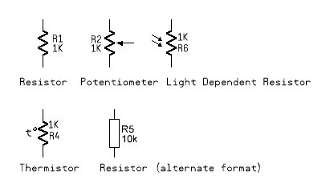

A resistance is a an item that restricts current flow between two points in a circuit. It can be a long length of copper wire, which has a known resistance for every 1000 feet or a packaged value of resistance known as a "resistor" which has been calibrated to a known value expressed in Ohms. It is named after the early scientist who explained the behavior of resistance while studying early battery circuits. A resistor will always obey Ohm's law unless it is allowed to rise in temperature to a point where the resistance compound breaks down or it alters the resistance as a result of the heat. A resistor will only dissipate excess power as heat and has no ability to store energy.

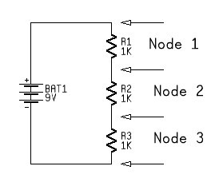

The flow of current through a resistor can generate heat so resistors that are designed to carry high currents are usually physically large to aid in dissipation of the heat generated.  If more current is pulled through a resistor than it can safely dissipate, then it can quickly reach a point where it can burn.  For this reason, resistors of similar value often come in packages that specify wattage, such as 1/8 watt, 1/4 watt, 1/2 watt, 1 watt, 5 watt etc.

### Ohms Law

The simplest circuit for discussion is a voltage source (3V) and a resistive load(1000 ohms) with a result of (3 mA).  Shown here:

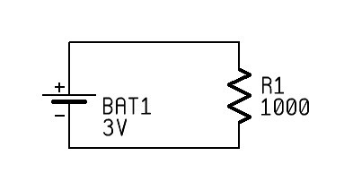

There is a path from the voltage source, through the load and then back to the voltage source for a complete circuit.  Ohms Law describes the relationships between the voltage source, the resistance and the current in a circuit.

It is expressed as:

{$$} I (Amps) = \frac {E (Volts)}{R (Ohms)} {/$$}

Based on this equation, we also get:

{$$} E (Volts) = I (Amps) * R (Ohms) {/$$}

and

{$$}R (Ohms) = \frac {E (Volts)}{I (Amps)} {/$$}

These are the math problems you will constantly be solving for when working with electronic parts.

Additionally, when two same-value resistors are placed in parallel, the resistance between the two nodes in the circuit will be 1/2 the resistance value on the parts and when placed in series, the resistance will be sum the value on the two parts.

This can be expanded to include unlike values as well, where:

{$$} R = \frac {R1 * R2 * R3} {R1 + R2 + R3}{/$$}  for Parallel

{$$} R = R1 + R2 + R3 {/$$} for Series

T> Many small hobbyist resistor packs will only have the 20% tolerance values.

## Selecting Conductors

As mentioned above, wires can have a resistance, especially when long lengths are used. The values of resistance for specific wires is a known entity for AWG wire gauge numbers, for example, 15 feet of 22 gauge (AWG) wire is 0.242 Ohms. For 50 feet this value is 0.8 ohms. Let's say we grabbed a a piece of common Category 5 Ethernet cable and ran it for 50 feet... the result is a now very measurable 2 ohms. This means that if you start with 5V and use the cable to deliver 40 milliamps to a load at the far end, the voltage will actually be 4.18V.  A voltage drop of 0.82 Volts.

It's not hard to see that the wiring you choose can be very important.

## Capacitors

A capacitor is a component that is based on the behavior of two metallic plates that are placed close to each other without touching. When a voltage is applied to this device, it becomes charged up to the voltage potential applied to it. It can supply it's charge back to the circuit if the potential that was being applied to it drops.  Therefore, a capacitor is a device that has the ability to temporarily store a charge, expressed as *capacitance* using the units known as a Farad. The Farad is actually much too large to use in normal everyday circuits so it is usually expressed in *micro farad* (1 millionth of a farad) or even smaller as the *nano farad* or *pico farad* value.

## Inductors

The flow of current through an conductor generates a magnetic field.  This can be demonstrated by placing a compass needle near an active conductor.  The needle will deflected from it's normal direction to become aligned with the magnetic field created by the current in the conductor. When the field is being created by the change in state of the voltage in the circuit (power is applied), the coil will energize and have an impact on the circuit (create a backward Electromotive force or EMF measures in voltage) until the magnetic field stabilizes. The amount of "impact" this action has on the circuit is measured in inductance. A stable magnetic field in an inductor act to will oppose any change of current in the circuit.  This means that if the current flowing in a circuit changes, the coil will act to oppose that change by turning that change into creation of a larger magnetic field (rise) or pulling charge from the field and feeding back into the circuit (fall).

Inductors are measured in Henries and like capacitors, the practical values are actually very small. This means that we will also use the prefixes *micro*, *milli* and *nano* when working with inductance values.

T> I'll be honest, you can probably go through life not really understanding how inductors work or needing to know why you would use one and you'd be just fine. Knowing that a wall transformer (two coils with mutual inductance) is based on the behavior inductance in an alternating current situation is more than most people know.

Coil and Resistor behavior example:

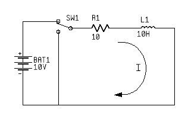

Usinf conventional current flow, when the switch is thrown into the position shown in the diagram, the DC voltage is connected across the circuit.  Normally, without the inductor, the current would rise in the circuit according to the slope indicated by the dashed line to point 'T' in the graph with respect to current and time.  With the inductor in the circuit, the slope changes because the coil will oppose current flow due the backward EMF from the coil while the magnetic field is being created and the resistor limits the maximum current flow. The end result is a combination that determines the time constant L/R (Time constant 1 second in this case). When the time delay has elapsed, only the resistor will impact the current flow until the switch is thrown back, removing the voltage current will continue to flow in the circuit.  The coil will try to counteract the change by dumping charge from the magnetic field back into the circuit, shown on the downward slope on the right side of the graph.

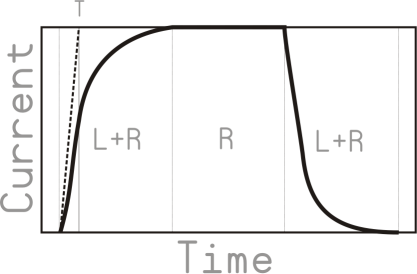

The electromagnetic field created by a coil can also be captured and put to work in a solenoid (to create mechanical movement in an axis) or in a relay, to mechanically close or open switch contacts. It should be noted that the resistance of a coil increases with signal frequency, but this is not something that an embedded  device developer usually needs to be concerned with.

## Mechanical Relays and Solenoids

A solenoid is an electro magnetic inductive coil with central cylinder that it can magnetically move when energized in a linear motion.  A relay is an electrical switch that uses solenoid to move the position of the mechanical contacts.  Many relays are encased in plastic to keep the moving parts free from outside interference and dust but you can still find open frame relay's. Some particularly small relays can be found in small metal can enclosures similar in size to transistors ans others make use of reed type switches to achieve small size.  

## Semiconductor Parts and Naming Standards

It is important that we understand the fundamental principles  of semiconductors if we are to have successful experiments and projects.

### Some history

In the early days of semiconductors there seemed to be a desire to avoid the chaos created by the vacuum tube industry where every manufacturer had their own part naming scheme.  It was difficult to tell which devices were rectifiers or triodes, etc.

A> These standards seem to no longer be as important as they once were in the early days of semiconductor manufacturing and the cold-war era when the military procurement methods seemed to demand standardization of parts to provide interchangeability between different manufacturers.  This is evidenced by the naming in use by manufacturers of Metal Oxide Semiconductor Field Effect Transistors (MOSFETs).  The current day naming of a MOSFET package provides little clue about what it is and much more about who designed it.

### USA

In 1924, the Electronic Industries Association was formed in the USA to create and maintain a set of standards for components used in the electronic industry.  In 1926, the National Electrical Manufactures Association (NEMA) was formed and together with EIA in 1958 they created some of the early component categorization standards for semiconductors that are still in use today. This joint organization was named JEDEC, Joint Electron Device Engineering Council and while the name has changed a bit over the years, it still exists.

One of JEDEC's roles in early semiconductor standards involved a parts numbering scheme that became popular in the 1960's for new semiconductor devices. The naming has an impact on parts still manufactured and used today, such as the 1N4001 rectifier diode and the 2N2222A transistor.  The 1N and 2N prefix was created to designate the physical layout of the device where xN describes the P-N Junction count. This usually indicates how many pins a device has, for example a 1N device has 2 pins and a 2N device will have 3 pins.  This is not always the case however, since many dual matched pair transistors would still use the 2N prefix even though it had a case with 6 pins.

*JEDEC attempted to create a similar numbering standard for integrated circuits but was never successful in having it gain acceptance.*

In the end, the JEDEC naming method suffers from being not very informative, for example, a 2N2222A is a general purpose low power bipolar junction transistor, a 2N3055 is a high power 10 transistor and 2N5457 is a general purpose junction field effect transistor (JFET). The only information that the 2N designation implies is that the part probably has 3 pins.

*Note: The EIA ceased to exist in 2011 and the role it played is now part of Electronic Components Industry Association (ECIA).  Most of us only know about the EIA as the standards organization that gave us things like the RS-232 standard for serial communications*

### EUROPE

Europe adopted a standard for semiconductor parts naming that was based on a pre-existing Philips standard used for vacuum tubes. These parts became known as the Pro Electron/EECA designation which was created in the mid 1960's. It used a much more informative prefix and suffix than the JEDEC standard used. Here is an example:

It is by far the most informative of the early naming standards available.

### Japan

Japan created Japanese Industrial Standards (JIS) to standardize parts for procurement with influence on much more than just electronics industry.  They created JIS-C-7012 standard which is similar to a combination of the JEDEC standard and the European standard but is slightly less informative.  Where the 1st digit denotes PN junction count like JEDEC and then an "S" and then one of the following to indicate type:

|	|Diode (no letter used) |
|A	|High frequency PNP BJTs |
|B	|Audio frequency PNP BJTs |
|C	|High frequency NPN BJTs |
|D	|Audio frequency NPN BJTs |
|E	|Diode |
|F	|Thyristor |
|G	|Gunn diode |
|H	|UJT |
|J	|P-channel FETs (both JFETs and MOSFETs) |
|K	|N-channel FETs (both JFETs and MOSFETs) |
|M	|TRIAC |
|Q	|LED |
|R	|Rectifier |
|S	|Signal diode |
|T	|Avalanche diode |
|V	|Varicap |
|Z	|Zener Diode |

It is very common to see the "2S" part of the number left off on the package markings with these parts.  You will sometimes need to add the "2S" when searching for a data sheet. For example, a device marked D945 is actually a 2SD945.  

## Semiconductor Data Sheets

The discussion about part numbers and standards leads us to the main reason we care about package numbering.  Data sheets are specifications provided by a manufacturer that summarizes the performance and  technical characteristics of a device.  They are not marketing White Papers but technical documents used by designers to determine if a part meets a design goal.  

Many newcomers to electronics experimenting are baffled by the terms that relate to transistor performance. There are many terms to consider, but most of these are not of any particular interest to technicians.

A data sheet  will describe physical characteristics such as packaging and mounting information, connectivity information, typical and maximum tolerances, variants such as packaging or operating temperature and some example application ideas or test conditions.  The may even contain errata from previous publications.

Let's look at a data sheet example.

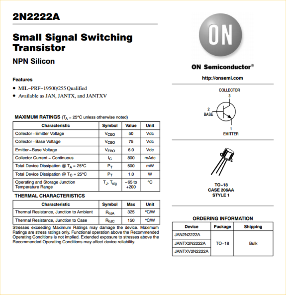

The layout of a data sheet for electronic components is fairly standardized.  It will show the manufacturer's name (ON Semiconductor), the part number (2N2222A), the intended use (small signal switching transistor) and type of part (NPN Silicon).

It will include package information, such as case style which on this part is the JEDEC standard case TO-18 which is a small metal can enclosure.  The JEDEC name translates to Transistor Outline Package style number 18 which itself has special characteristics for heat dissipation.

In a tabular section, it will include the electrical characteristics of the part such as voltage ratings, current ratings and temperature characteristics.  In the case of the 2N2222A, we see that the part can "switch" up to 50 volts and supply up to 800 milliamps at the collector pin via the emitter pin.

Additional information in the data sheet will provide information such as DC Current gain (Hfe) sometimes called "beta" which in this case is pretty much between 100 and 300 depending on emitter current being roughly 200mA and the base current of around 15ma.

These gain values are less critical when using the device as a switch since you just need to make sure you supply enough voltage and current at the base for the device to fully "turn on".  Typically, if you stay below 200mA, you can use 1K resistor at the base with 5V logic and have a completely usable transistor switch.

At the end of most data sheets you will also find physical dimension data, useful for defining the part to be used in Printed Circuit Board (PCB) assemblies.

## Diodes

A diode is a two-terminal device that allows current
to flow in one direction. In electronics terms, diodes are a {$$}pn{/$$} junction devices.  The concepts behind P type and N type of semiconductor doping are rather complex. In layman's terms though, it involves an area with P-doped "holes" and an area with N-doped spare electrons in a common substrate. The point at which the two materials meet creates a depletion layer where holes and electrons are basically "kept in place" until the correct conditions are met known as the junction threshold.  This is commonly around 0.6 volts.

When the Anode (p type) is more positive than the Cathode (n-type), the barrier at the junction is "forward-biased" it breaks down because the potential barrier is lowered as electrons reach the region from this direction and this allows current to flow.

When the polarity is reversed or "reverse-biased", the PN channel offers a barrier to current flow across the PN junction area because the charges pull away from the junction further depleting the area of carriers and  the result is that no current will flow.

### Rectifiers
All diodes and rectifiers exhibit low resistance when the anode is positive with respect to the cathode and high resistance when the anode is negative with respect to the cathode. Rectifiers are created by manufacturing much larger pn junctions to carry higher voltage or current.

The term diode and rectifier are mostly interchangeable.  Rectifier is mostly used when a diode is part of a a power supply used to convert alternating current into direct current for use standard power supply designs.  Thus, the term rectifier is used to describe diodes used in high voltage or high current situations mostly associated with power supplies.

Diode is used when the device is employed in a restrict current or signal flow in a specific direction whether it is AC or DC.   All rectifiers are diodes.

### Zener Diodes

A zener diode is a diode that actually has more permissive reverse bias mode than a standard diode.  This means that this kind of diode can be created with known reverse-bias breakdown voltage, allowing them to be used as voltage references and voltage regulators.

### Silicon Controlled Rectifier (SCR)

Once known as the "thyristor", since it's operation was similar to the vacuum tube layout called the "thyratron", the SCR is a 4-layer device made up of PNPN junctions. They are most commonly used in AC circuits where the AC signal can be turned on midway in the AC phase, creating a reduction of available Electro Motive Force delivered to the AC load.

### Transient Voltage Suppression Diodes
The device operates by shunting excess current when the induced voltage exceeds the avalanche breakdown threshold. It is therefore a clamping device, that will prevent excessive over voltage in a circuit. It can recover from this condition without being destroyed in the process.

The devices can be unidirectional or bidirectional by adding 2 devices in the same package aligned in opposing directions.  

## Transistors

We don't really need to know a great deal about transistors.  In fact, we will nearly always use them like *switches* since this is the basis of digital computing.  It is unlikely that we will have many applications where we want to use these like audio frequency amplifiers, for example.

There are actually many types of transistors that have been created sine the first experiments in the late 1940's.  You might have heard about Bipolar Junction Transistors (BJT's) and these are still the most common type.  There are also Junction Field Effect Transistors (JFET) and Metal Oxide Semiconductor Field Effect Transistor (MOSFET) to name a few others.  What these names have in common is that they describe the inner workings (the manufacturing process) that explain somewhat how they work.  A JFET is actually similar to the BJT in physical construction but it performs quite differently.  A MOSFET is similar to JFET in operation, however the MOSFET has an "insulated gate", making it have a very low "loading" of the circuitry that drives the gate pin.

Transistor capabilities vary greatly, with some being designed for lower frequency use (between DC and the audio frequencies) while others are designed for very high frequency usage (Radio signals).  Other factors include power ratings that allow some transistors to be used to switch heavy loads while others are designed for more light duty.  This is often apparent by the *case* or packaging used to encapsulate the device. Some cases are designed to be attached to external heat sinks to suck away excess heat generated by the current passing through the device.

As we saw in the data sheet above, there are some terms that we focused on, such as *beta*. This relates to the current gain of a BJT.  This can be an important parameter depending on what we are designing. If, for example, we have a device whose *beta* (Hfe) is 100, and we supply 1mA of current into the base, we will get up to 100mA flowing at the collector.

### NPN versus PNP

We can choose to use NPN or PNP style BJT's in our designs, or N-Channel and P-Channel style MOSFETS, when we design from the ground up.  Selecting the type we use will mostly be about polarity and load arrangements.

The N-Channel and NPN variants are certainly more numerous that the P-Channel and PNP varieties. Some reasons for this are that it is due to the nature of silicon based semiconductors.  There are just more N-Type charge current carriers in the silicon when compared to the P-Type. This equates to more speed.  It is also true that using large N-Type silicon wafers to start production of semiconductors is more cost effective.  A PNP type transistor requires up to 3 times more surface are to make a device that is the equivalent to a similar NPN.

How *we* normally use NPN and PNP with Arduino switching circuits often mimics how the micro controller and logic IC's are designed.  The main reason we use external transistors is to add muscle to the rather low current *signals* we get from the pins.  When we want to do heavy work, like operate a motor or relay, we add an external device to *do the work*.

Current Sink

: We would use an NPN or N-channel device  to switch on or off the ground path to a  controlled device. This is known as *current sinking*.  

Current Source 

: We would use a PNP or P-channel device to switch the the "supply" side of a device being controlled.  This is known as both *high-side* switching and *current sourcing*.

It is far more popular to switch the low-side of a circuit, since you do not need to concern yourself with the operating voltage on the high-side of the device being controlled.  For example, if you use a low side switch, you can control it with a 5 volt signal at the base and not care that the high side of the device being controlled is being supplied by a much higher voltage, which might be 12, 24, maybe 50V or more.

A> High voltage NIXIE tubes of the 1950' and 60's can be driven with Logic IC's while the high side, the anode, of the tubes operates at 170 volts DC. While it is clearly safer to use high voltage logic IC's and transistors, you can actually drive Nixie tube cathodes with transistors that have much lower breakdown voltages.

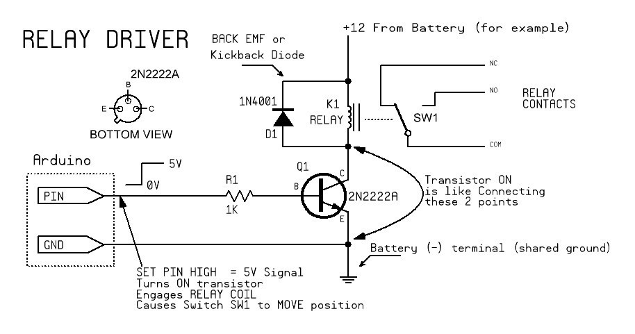

The issues with a PNP driver become complicated fast.  To be able to turn the PNP transistor all the way off, you will need a voltage close to the Emitter voltage. This means that you need a pullup resistor (R1) to 12V. This also means that you are applying this 12 volts at a point *too* close to the Arduino pin, and the *Arduino* pin will want nothing to do with any voltage higher than the supply voltage on the *Arduino* board.  To do this driver properly, you will need to add a NPN transistor in an open collector manner added to interface with the PIN, making using a PNP in this way less practical than the NPN method unless the positive voltage being switched is the same or less than the logic voltage on the board.

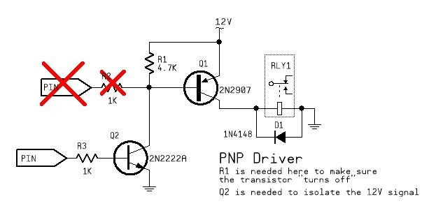

## Other Discrete Semiconductors

**Unijunction Variants**

There are some oddballs in the transistor family that are much less common, such as the Unijuntion Transistor, which is a modified PN junction device with 3 leads.  It is used as an active component in relaxation oscillators. This part os basically obsolete and was mostly replaced by the Programmable Unijunction Transistor (PUT).

*ujt drawing*

The Progammable Unijuction has essentially 2 anodes and 1 cathode.  It is a 4 layer (PNPN) device and the most common part is known as the 2N6027. (So again we see that the JEDEC naming standard was tossed out by the time this was designed)  The programmable lead is supplied by a voltage reference that when it is reached allows the PN junction, the *other* anode*, to conduct when the threshold voltage is reached.  This makes this device, like the standard unijunction device, useful in oscillators.

*put drawing*

IGBT

## Hands-On Examples

### Using a Data Sheet and Ohms Law 

So, let's do an example of how to determine the best value of a resistor using Ohm's Law.  Below is our final circuit example and we will see how we determined the correct values.

1) We will determine the value based on a power supply voltage of 5 volts
2) We will read the data sheet to determine the optimal conditions for the LED

So lets look at the data sheet:

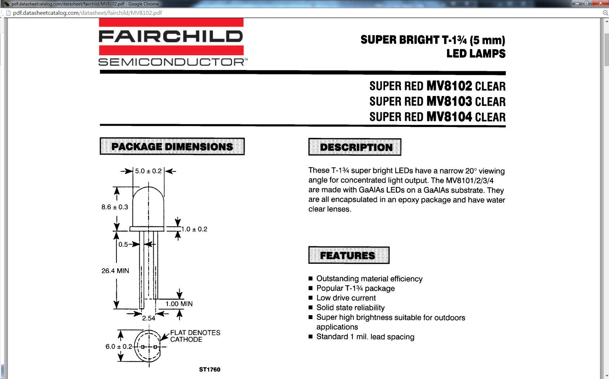

well, we can skip this stuff... it's just a quick summary on the front page. What do we need to know about this LED?  Let's look at the Maximum Ratings section.  

W> Reminder: *Maximum Ratings* are the values you should not exceed.  Exceeding these values will lead to damage the component or at the very least, exclude the manufacturer from supplying you with a warranty replacement.

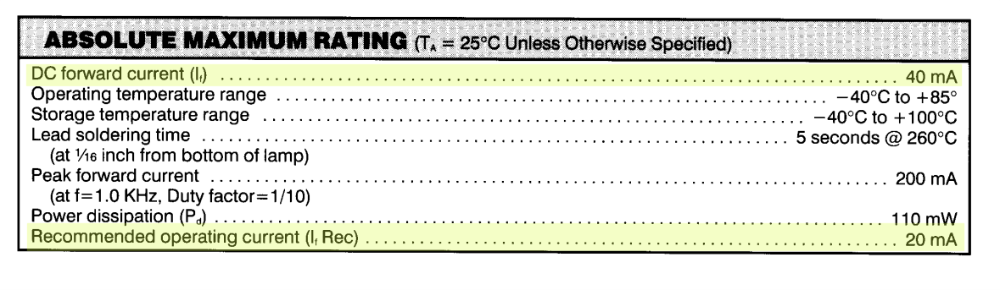

I have highlighted two of the lines in the maximum ratings table:

|1| DC Forward Current|(I Forward)|40mA|
|2| Recommended Current|(I Forward Reccommended)|20mA|

Line 1 is the maximum safe constant current supplied to the device without damaging it.
Line 2 is not normally found in data sheets Maximum Ratings tables but is very handy.

We still have some more data that is needed from the data sheet so lets look for it.

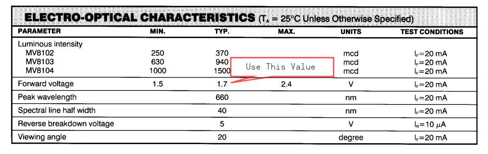

we need to know the nominal forward voltage of the device, or the voltage where it will start behaving like an LED. 

So lets review what we know:  The source voltage will be 5 volts. The LED current will be 20 mA.  The forward voltage drop of the LED is rated at 1.7 volts.

Ohm's law states that resistance is voltage divided by current, expressed as {$$}R = \frac {E}{I} {/$$}.

So, Ohm's law has us calculate; {$$} Resistance = \frac {5 Volts}{0.020 amps} = 250 Ohms{/$$}.  

**Wait! That's not right.**  We forgot the forward voltage drop of the LED. So, we subtract 1.7 volts 5 volts for 3.3 volts and we do it again.  And this time we get 165 Ohms.  

Now we see where the sequence of available resistors helps us determine the best match.  It is most likely that you have 20% resistors on hand and the closest conservative match for 160 Ohms is 220 Ohms and the closest match for the "bad math" solution is still... 220 Ohms.  This is most likely why you often see people create examples where the they forget to include the forward voltage drop in the equation. If, however, you have a collection of 10% or 5% resistors on hand, you could find a closer match. You just have to cope with the fact that 10% and better resistors usually cost more.

T> The truth is, you are more likely to find a 220 Ohm resistor in your collection than a 200 ohm resistor or a 180 Ohm resistor and the 220 Ohm device will make the LED work acceptably well.  

So, this doesn't mean that it's always OK to skip the forward voltage value in the calculation, but in this scenario it just means that it doesn't make a huge difference in the end result either.

## Schematics

## Printed Circuits

A printed circuit board is a conductive pattern applied to one or both sides of an insulating material base. Some components can even be manufactured as part of the printed circuit design, such as inductors, capacitors and antenna.  

### Base Materials

Fiberglass Laminate (FR4) is glass reinforced epoxy laminate material that offers good resistance to flames and has high mechanical strength.  It is the most commonly used rigid backbone upon which copper clad laminates are  made for PCB manufacture.

Another common material is a paper based phenolic copper clad board but it has inferior physical strength to FR4.

Other exotic materials are available, such as copper clad glass-cloth teflon, copper clad kapton or copper clad mylar all used in more flexible circuit boards.

## Printed Circuit Board Manufacturing Process.

### Design
The master design used for copper clad laminate etching is known as the "master artwork".  Careful workmanship and accuracy is important.  It is considered "best practice" to avoid 90 degree bends in printed wiring paths.

### Etching  (Gootee Method)

### Plating

MG Chemicals

Cool-Amp

### Coating

## Project 1 Build your own Lab Power Supply
