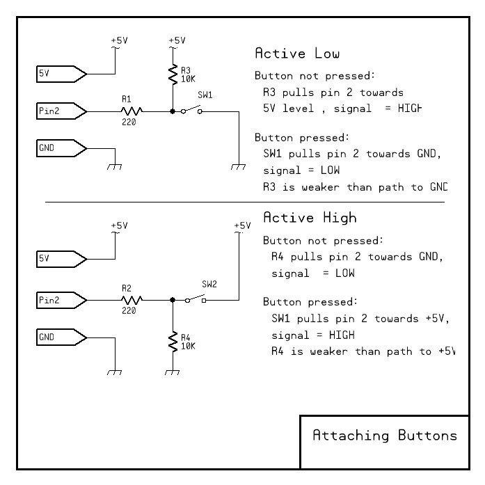

-# Digital Logic

# Digital Logic

## Ones and Zero's

Digital Logic is about signals.  Signals that indicate 2 states of logic using a 1 for "on" or "true" and and 0 for "off or "false".  At any point in time, a designer change whether an action is performed on a "1" state or a "0" state, meaning that sometimes the inverted or "negated" state of a signal is the meaningful state.  This will be discussed more in the next section.

So, if voltage levels indicate 1's and 0's, at what point does a logiical "0" become a logical "1"?  Well, as with many things,  it depends.  Here is a general guideline for TTL Logic that runs on 5 Volts.

You might notice that even with TTL logic running with 3.3 Volts as Vdd, a logic "1" and Logic "0" will still be valid states.  This is why interfacing 3.3V logic with 5V logic works, as long as you prevent 5V signals from reaching 3.3V input pins if they are not 5V tolerant.  This is done with the help of a 3.3 to 5V level-shifter circuit or device such as a 74LVC245.

Digital inputs can be funny things when left alone with neither a 0 or 1 level signal attached to them. If you recall the the section about voltage and electric fields, there can be induced voltage even without a wired conductor attached to a pin, making it possibly change state due to a nearby finger.

This is why, when using pins as digital inputs, you will often see the "INTERNAL_PULLUP" employed or the use of an external 10K resistor to 5V added, to hold the pin in a known state while still allowing it to be pulled to the opposite state with an opposing signal level.

A> When working on a breadboard, I always add the extra 200 Ohm current limiting resistor to protect the pin from clumsy fingers. In a final design, it can be omitted. The resistor will also protect you from accidental programming errors if you mistakenly make this an output pin while prototyping. It could potentially allow a button press to produce a short circuit and damage the pin.  I also never use "pulldown's" or the Active High method since it is not compatible with "open collector" or "open Drain" logic IC's and unlike the other method, there are no internal "pulldown" options.  So, I show the Active High methods merely as a demonstration and not a recommendation.  

## Boolean Logic

## Flip Flops and Registers

## Buffers and Drivers

## Counters

